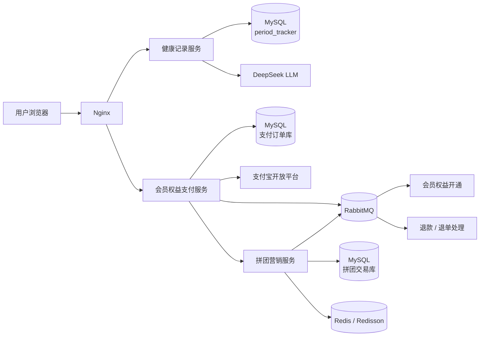

<div align="center">

# 🌙 月月友

### 生理期记录 · AI 健康分析 · 会员权益 · 拼团优惠 · 支付履约

一个围绕女性生理周期记录与会员服务构建的完整业务系统。

系统包含健康记录、AI 健康建议、会员年卡、拼团营销、支付宝支付、异步权益履约、支付补偿以及退款退单等功能，并通过多个独立 Spring Boot 服务协作完成完整业务流程。

<p>
  
  
  
  
  
  
  
</p>

<p>
  
  
  
</p>

</div>

---

## 📌 目录

* [项目介绍](#项目介绍)
* [功能预览](#功能预览)
* [系统架构](#系统架构)
* [核心业务流程](#核心业务流程)
* [技术栈](#技术栈)
* [DDD 分层设计](#ddd-分层设计)
* [健康记录服务](#健康记录服务)
* [会员权益支付服务](#会员权益支付服务)
* [拼团营销服务](#拼团营销服务)
* [核心接口](#核心接口)
* [数据库设计](#数据库设计)
* [前端设计](#前端设计)
* [部署说明](#部署说明)
* [配置说明](#配置说明)
* [后续优化](#后续优化)

---

# 项目介绍

**月月友** 是一个围绕生理周期管理构建的 Web 应用。

用户可以记录个人生理周期和每日症状，查看周期趋势，并根据历史记录获取 AI 健康建议和个人健康画像。

在基础记录功能之外，系统还提供会员年卡和拼团优惠功能。用户可以参与拼团活动购买会员，通过支付宝完成支付。支付成功后，系统自动完成拼团结算和会员权益开通。

针对支付回调丢失、超时未支付、拼团失败、退款等异常场景，系统提供相应的补偿和逆向处理流程。

整个系统由三个独立业务服务组成：

| 服务          | 主要职责                  |
| ----------- | --------------------- |
| 🌙 健康记录服务   | 用户、周期、症状、数据展示、AI 健康建议 |
| 💳 会员权益支付服务 | 商品下单、支付宝支付、支付补偿、会员权益  |
| 🤝 拼团营销服务   | 营销试算、拼团锁单、成团结算、退款退单   |

服务之间通过 HTTP 和 RabbitMQ 进行协作。

当前项目没有引入 Spring Cloud 注册中心、配置中心或统一 API Gateway，各服务通过明确的业务边界和接口协议进行通信。

---

# 功能预览

## 登录与注册

<table>
  <tr>
    <td align="center">
      
      <br/>
      登录页
    </td>
    <td align="center">
      
      <br/>
      注册页
    </td>
  </tr>
</table>

---

## 健康记录与 AI 分析

<table>
  <tr>
    <td align="center">
      
      <br/>
      首页周期状态
    </td>
    <td align="center">
      
      <br/>
      AI 健康分析
    </td>
    <td align="center">
      
      <br/>
      AI 健康建议
    </td>
  </tr>

  <tr>
    <td align="center">
      
      <br/>
      周期数据看板
    </td>
    <td align="center">
      
      <br/>
      我的页面
    </td>
    <td align="center">
      
      <br/>
      AI 人物画像
    </td>
  </tr>
</table>

---

## 档案与周期管理

<table>
  <tr>
    <td align="center">
      
      <br/>
      个人档案
    </td>
    <td align="center">
      
      <br/>
      生理期管理
    </td>
  </tr>
</table>

---

## 会员年卡、拼团与支付

<table>
  <tr>
    <td align="center">
      
      <br/>
      拼团会员页
    </td>
    <td align="center">
      
      <br/>
      发起拼团
    </td>
    <td align="center">
      
      <br/>
      订单管理
    </td>
  </tr>

  <tr>
    <td align="center">
      
      <br/>
      支付宝支付
    </td>
    <td align="center">
      
      <br/>
      支付完成
    </td>
  </tr>
</table>

---

# 系统架构



## 服务职责

### 🌙 健康记录服务

负责用户健康数据相关功能：

* 用户注册与登录
* 用户档案管理
* 生理周期记录
* 周期预测
* 每日症状记录
* 历史周期数据展示
* AI 健康建议
* AI 人物画像

---

### 💳 会员权益支付服务

负责会员购买和支付履约：

* 会员商品查询
* 创建业务订单
* 拼团营销试算
* 拼团锁单
* 支付宝预支付
* 支付回调验签
* 支付状态更新
* 支付掉单补偿
* 超时订单关闭
* 会员权益开通
* 用户退款

---

### 🤝 拼团营销服务

负责营销优惠和拼团交易：

* 活动配置
* 营销试算
* 优惠策略
* 拼团锁单
* 拼团名额占用
* 支付结算
* 成团判断
* 拼团退款
* 退单补偿
* 动态配置与限流

---

# 核心业务流程

系统主要业务链路如下：

```text
用户注册 / 登录
        ↓
维护个人档案
        ↓
记录生理周期和每日症状
        ↓
查看周期状态与历史数据
        ↓
触发 AI 健康建议 / 人物画像
        ↓
进入会员年卡页面
        ↓
进行营销试算
        ↓
创建支付订单
        ↓
拼团锁单并占用名额
        ↓
调用支付宝生成支付单
        ↓
用户完成支付
        ↓
支付宝异步回调
        ↓
RSA2 签名校验
        ↓
更新订单支付状态
        ↓
拼团结算
        ↓
RabbitMQ 异步开通会员权益
```

异常情况下，根据订单状态进入对应处理流程：

```text
支付回调丢失
    ↓
定时查询支付宝交易状态
    ↓
补偿订单状态


超时未支付
    ↓
关闭支付订单
    ↓
释放拼团资源


拼团失败 / 用户退款
    ↓
执行退款
    ↓
退单
    ↓
恢复拼团名额
```

---

# 技术栈

## 基础技术

| 分类          | 技术                    |
| ----------- | --------------------- |
| 开发语言        | Java 8                |
| 核心框架        | Spring Boot 2.7.12    |
| Web         | Spring MVC            |
| ORM / DAO   | MyBatis               |
| 数据库         | MySQL 8               |
| 数据库连接池      | HikariCP              |
| 缓存          | Redis、Guava Cache     |
| 分布式协调       | Redisson              |
| 消息队列        | RabbitMQ              |
| HTTP Client | Retrofit2、OkHttp      |
| AI          | DeepSeek LLM          |
| 支付          | 支付宝 Java SDK          |
| 构建工具        | Maven                 |
| 容器          | Docker、Docker Compose |
| Web Server  | Nginx                 |
| 日志          | Logback               |

---

## 健康记录服务

| 分类    | 技术                          |
| ----- | --------------------------- |
| 核心框架  | Spring Boot、Spring MVC      |
| 数据访问  | MyBatis、MySQL、HikariCP      |
| 工程组织  | Maven 多模块、DDD 分层            |
| 密码安全  | BCrypt                      |
| AI 调用 | DeepSeek API、RestTemplate   |
| JSON  | Fastjson                    |
| 前端    | HTML、CSS、原生 JavaScript      |
| 网络请求  | Fetch API                   |
| 部署    | Docker、Docker Compose、Nginx |

---

## 会员权益支付服务

| 分类   | 技术                     |
| ---- | ---------------------- |
| 核心框架 | Spring Boot、Spring MVC |
| 事务   | Spring Transaction     |
| 数据访问 | MyBatis、MySQL          |
| 架构   | DDD、Port / Adapter     |
| 支付   | 支付宝 Java SDK           |
| 签名验证 | RSA2                   |
| 服务调用 | Retrofit2、OkHttp       |
| 本地缓存 | Guava Cache            |
| 消息队列 | RabbitMQ               |
| 定时任务 | Spring `@Scheduled`    |
| 异步执行 | 自定义线程池                 |
| JSON | Fastjson               |
| 工具库  | Hutool、Apache Commons  |

---

## 拼团营销服务

| 分类    | 技术                              |
| ----- | ------------------------------- |
| 核心框架  | Spring Boot、Spring MVC          |
| 数据访问  | MyBatis、MySQL                   |
| 缓存    | Redis                           |
| 分布式协调 | Redisson                        |
| 人群标签  | Redis Bitmap                    |
| 消息队列  | RabbitMQ                        |
| 业务设计  | 策略模式、责任链、策略树、模板方法、工厂模式          |
| 一致性   | 本地消息表、失败重试、补偿任务                 |
| 幂等与并发 | SET NX、Redis 原子计数、数据库条件更新       |
| 动态治理  | 动态开关、灰度、渠道控制、限流                 |
| 监控接口  | Spring Boot Actuator、Micrometer |
| 部署    | Docker、Docker Compose、Nginx     |

---

# DDD 分层设计

项目将核心业务逻辑与基础设施实现进行分离。

主要模块包括：

```text
API
    ↓
Trigger
    ↓
Domain
    ↓
Repository / Port
    ↓
Infrastructure
```

其中：

* `API`：接口协议、DTO、统一响应结构
* `Trigger`：Controller、MQ Listener、定时任务等业务触发入口
* `Domain`：实体、聚合、领域服务和业务规则
* `Infrastructure`：数据库、Redis、MQ、HTTP Client 等技术实现
* `Types`：枚举、异常和通用类型
* `App`：Spring Boot 启动及组件配置

---

## record-me

```text
record-me
├── record-me-api
│   └── DTO、接口协议、统一响应对象
│
├── record-me-domain
│   └── 用户、周期、症状等核心领域逻辑
│
├── record-me-infrastructure
│   └── MyBatis DAO、PO、Repository 实现
│
├── record-me-trigger
│   └── Controller、AI 请求入口
│
├── record-me-types
│   └── 枚举、异常、公共类型
│
└── record-me-app
    └── Spring Boot 启动与基础配置
```

---

## payment-service

```text
payment-service
├── payment-api
│   └── 接口协议、DTO
│
├── payment-domain
│   └── 订单、支付、会员权益领域逻辑
│
├── payment-infrastructure
│   └── MyBatis、RabbitMQ、支付宝、营销服务适配器
│
├── payment-trigger
│   └── Controller、MQ Listener、定时任务
│
├── payment-types
│   └── 枚举、异常、事件对象
│
└── payment-app
    └── Spring Boot 启动和组件配置
```

领域层通过 Repository 和 Port 接口访问外部资源。

MyBatis、支付宝 SDK、RabbitMQ 和外部 HTTP 服务等具体实现由 Infrastructure 层完成。

---

## group-marketing-service

```text
group-marketing-service
├── group-api
│   └── 接口定义、请求和响应 DTO
│
├── group-trigger
│   └── HTTP API、RabbitMQ Consumer、定时任务
│
├── group-domain
│   └── 营销试算、锁单、结算、退单
│
├── group-infrastructure
│   └── MyBatis、Redis、RabbitMQ、HTTP
│
├── group-types
│   └── 枚举、异常、通用设计组件
│
└── group-app
    └── Spring Boot 启动与组件配置
```

---

# 健康记录服务

## 用户登录与档案

系统支持：

* 用户注册
* 用户名登录
* 手机号登录
* 密码复杂度校验
* BCrypt 密码加密存储
* 用户档案维护

用户档案包含：

* 昵称
* 头像
* 手机号
* 生日
* 身高
* 体重
* 平均周期天数
* 平均经期天数

这些数据会用于周期计算以及 AI 健康分析。

---

## 生理周期管理

用户可以：

* 开始一次生理周期
* 结束当前周期
* 修改历史周期记录
* 查看历史周期
* 查看平均周期
* 查看预计下次经期日期

系统记录的数据包括：

```text
当前周期开始时间
当前周期结束时间
平均周期天数
平均经期天数
预计下次开始时间
预计本次结束时间
当前周期状态
```

周期结束后，可以根据历史周期重新计算平均周期长度。

---

## 每日症状记录

用户可以记录当天身体状态，包括：

* 流量
* 疼痛等级
* 心情
* 备注

症状数据与用户周期数据关联，可用于后续数据展示和 AI 分析。

---

## 数据看板

数据页面展示：

* 最近周期记录
* 平均周期天数
* 平均经期天数
* 周期变化趋势

---

## AI 健康建议

系统通过 DeepSeek LLM 提供 AI 分析能力。

AI 请求采用用户主动触发方式，而不是页面刷新后自动执行。

### 首页健康建议

用户点击 AI 卡片后，系统根据：

```text
用户档案
+
当前周期状态
+
历史周期
+
每日症状
```

整理上下文并请求大语言模型生成健康建议。

### AI 人物画像

人物画像会综合：

* 用户基本信息
* 历史周期数据
* 症状记录
* 身体状态

生成更加完整的健康信息总结。

AI 输出主要用于健康信息参考，不提供疾病诊断和处方建议。

---

# 会员权益支付服务

## 支付流程

会员年卡支付流程：

```text
创建业务订单
        ↓
营销试算
        ↓
拼团锁单
        ↓
计算最终支付金额
        ↓
调用支付宝预支付
        ↓
生成支付表单
        ↓
用户支付
        ↓
支付宝异步通知
        ↓
验证交易状态
        ↓
RSA2 验签
        ↓
更新订单状态
        ↓
拼团结算
        ↓
MQ 通知会员权益服务
```

---

## 重复订单处理

创建订单前会检查用户是否已经存在同商品未支付订单。

根据订单状态分别处理：

### 已存在可用支付链接

直接复用原订单。

```text
请求下单
   ↓
发现未支付订单
   ↓
支付链接仍然有效
   ↓
返回已有订单
```

### 支付链接生成失败

```text
已有订单
   ↓
支付单未成功生成
   ↓
重新调用支付宝预支付
```

### 营销锁单未完成

重新执行营销锁单流程。

---

## 支付回调

支付宝支付完成后会向服务端发送异步通知。

服务端执行：

```text
接收支付宝参数
        ↓
校验支付宝交易状态
        ↓
RSA2 验签
        ↓
查询本地订单
        ↓
推进订单状态
        ↓
执行后续结算
```

订单更新采用状态判断，避免重复回调重复推进业务流程。

---

## 支付掉单补偿

支付系统不能完全依赖第三方异步回调。

系统通过定时任务扫描待支付订单：

```text
待支付订单
     ↓
查询支付宝交易状态
     ↓
     ├── 已支付
     │      ↓
     │   补偿订单状态
     │
     └── 未支付
            ↓
         继续等待
```

超过订单有效期仍未支付时：

```text
订单超时
    ↓
关闭支付宝交易
    ↓
关闭本地订单
    ↓
释放营销锁单
```

---

## RabbitMQ 异步履约

支付完成后的部分业务通过 RabbitMQ 异步执行。

主要包括：

* 支付成功后的会员权益开通
* 拼团结算通知
* 拼团失败退款
* 退单处理

通过消息队列将支付状态更新和后续履约流程进行拆分，避免在支付回调线程中同步执行所有业务操作。

---

## 外部营销服务调用

支付服务通过 Retrofit2 / OkHttp 调用拼团营销服务。

主要接口包括：

```text
营销试算
拼团锁单
支付结算
拼团退款
```

领域层只依赖营销 Port 接口：

```text
Domain
   ↓
MarketingPort
   ↓
Infrastructure
   ↓
Retrofit / OkHttp
   ↓
拼团营销服务
```

这样可以避免核心业务逻辑直接依赖具体 HTTP Client。

---

# 拼团营销服务

## 拼团交易流程

```text
营销试算
    ↓
拼团锁单
    ↓
Redis 占用拼团名额
    ↓
订单落库
    ↓
等待支付
    ↓
支付结算
    ↓
判断是否成团
    ↓
发送结算通知
```

如果订单取消或拼团失败：

```text
退单
  ↓
退款
  ↓
释放拼团资源
  ↓
恢复名额
```

---

## 营销试算策略树

营销试算通过策略树逐步执行不同规则。

```text
请求进入
   ↓
参数校验
   ↓
系统降级判断
   ↓
用户灰度判断
   ↓
查询商品
   ↓
查询活动
   ↓
计算优惠
   ↓
人群判断
   ↓
生成最终试算结果
```

不同业务规则由独立节点负责。

当需要增加新的营销规则时，可以增加新的策略节点，而不需要修改完整试算流程。

---

## 优惠策略

系统通过策略模式实现不同优惠方式：

| 策略   | 说明   |
| ---- | ---- |
| `N`  | 固定价格 |
| `ZJ` | 直减   |
| `ZK` | 折扣   |
| `MJ` | 满减   |

运行时根据活动配置选择对应策略。

整体结构：

```text
优惠配置
   ↓
策略工厂
   ↓
选择优惠策略
   ↓
计算优惠价格
```

---

## 交易责任链

锁单、结算和退单流程中的规则通过责任链组织。

### 锁单责任链

```text
活动状态检查
      ↓
用户参与次数检查
      ↓
拼团队伍名额检查
      ↓
执行锁单
```

### 结算责任链

```text
外部交易单检查
      ↓
渠道来源检查
      ↓
订单状态检查
      ↓
执行结算
```

### 退单责任链

```text
加载订单
   ↓
重复退单检查
   ↓
选择退单策略
   ↓
执行退单
```

---

## Redis 拼团名额控制

拼团锁单时需要避免多个请求同时占用同一个名额。

系统结合 Redis 与数据库完成名额控制。

使用的机制包括：

* Redis 原子计数
* `SET NX`
* Redisson 分布式锁
* Redis Key 过期时间
* 数据库条件更新
* 锁单失败后的名额恢复
* 退单后的名额补偿

基本流程：

```text
用户锁单
   ↓
检查拼团状态
   ↓
Redis 原子占用名额
   ↓
创建数据库订单
   ↓
成功
```

如果数据库订单创建失败：

```text
Redis 名额已占用
       ↓
数据库操作失败
       ↓
恢复 Redis 名额
```

---

## 本地消息表

支付结算和退单流程中，需要在业务状态更新后向其他系统发送通知。

系统将业务数据和通知任务写入同一个数据库事务。

```text
数据库事务开始
     ↓
更新业务状态
     ↓
写入通知任务
     ↓
事务提交
```

后台任务随后处理通知：

```text
查询待发送任务
       ↓
发送 HTTP / MQ
       ↓
      成功
       ↓
更新任务状态
```

通知失败后：

```text
发送失败
   ↓
记录失败次数
   ↓
等待下一轮重试
```

多实例执行补偿任务时，通过分布式锁控制同一个任务的处理。

---

## 退单处理

不同订单状态对应不同的退单策略。

主要包括：

```text
未支付 + 未成团

已支付 + 未成团

已支付 + 已成团
```

退单完成后，通过 MQ 恢复相关拼团资源。

同时使用订单维度的幂等控制避免重复恢复。

---

## 动态配置

拼团营销服务支持部分运行时控制能力：

* 系统降级开关
* 用户灰度比例
* 渠道黑名单
* Redis 缓存开关
* 接口访问频率限制

例如在营销活动上线初期，可以通过灰度配置只向部分用户开放活动。

出现异常时，也可以通过动态开关关闭部分营销能力。

---

## Redis Bitmap 人群标签

Redis Bitmap 用于保存布尔型用户标签。

例如：

```text
VIP 用户
新用户
活动目标用户
特定营销人群
```

判断用户是否属于某个人群时，可以直接查询对应 Bitmap 位。

---

## 并行查询

营销试算过程中，部分数据之间没有依赖关系，例如：

```text
商品信息
+
营销活动配置
```

这些数据可以通过线程池并行查询，然后统一汇总到试算上下文。

线程池支持配置：

* 核心线程数
* 最大线程数
* 队列容量
* 拒绝策略

---

# 核心接口

## 健康记录服务

| 模块 | 接口                                      | 功能        |
| -- | --------------------------------------- | --------- |
| 认证 | `POST /record/auth/login`               | 用户登录      |
| 认证 | `POST /record/auth/register`            | 用户注册      |
| 首页 | `POST /record/index/query_user_info`    | 查询首页信息    |
| 周期 | `POST /record/index/start_cycle_record` | 开始周期      |
| 周期 | `POST /record/index/over_cycle_record`  | 结束周期      |
| 症状 | `POST /record/index/query_symptom`      | 查询当天症状    |
| 症状 | `POST /record/index/change_symptom`     | 新增 / 修改症状 |
| 数据 | `POST /record/data/query_cycle_list`    | 查询周期数据    |
| 我的 | `POST /record/mine/getUsrInfo`          | 查询个人档案    |
| 我的 | `POST /record/mine/changeUserInfo`      | 修改个人档案    |
| 我的 | `POST /record/mine/getUserRecord`       | 查询周期记录    |
| 我的 | `POST /record/mine/changeUserRecord`    | 修改周期记录    |
| AI | `POST /record/ai/health_advice`         | AI 健康建议   |
| AI | `POST /record/ai/persona`               | AI 人物画像   |

---

## 支付与拼团服务

| 模块   | 功能               |
| ---- | ---------------- |
| 商品   | 查询会员商品和会员状态      |
| 营销试算 | 根据商品、用户和活动计算优惠   |
| 拼团锁单 | 创建拼团订单并占用名额      |
| 支付下单 | 创建支付订单并生成支付宝支付页面 |
| 支付回调 | 接收并验证支付宝异步通知     |
| 支付补偿 | 查询支付宝订单状态        |
| 超时关单 | 关闭超时未支付订单        |
| 成团结算 | 判断拼团状态并完成结算      |
| 会员权益 | 支付成功后开通会员        |
| 退款退单 | 根据订单状态执行退款和资源恢复  |

---

# 数据库设计

## 健康记录服务

### `user_info`

保存用户基础信息：

```text
用户 ID
用户名
密码 Hash
昵称
头像
手机号
生日
身高
体重
平均周期
平均经期
```

### `cycle_record`

保存生理周期：

```text
用户 ID
开始日期
结束日期
当前周期标记
逻辑删除状态
```

### `daily_symptom`

保存每日症状：

```text
用户 ID
记录日期
流量
疼痛等级
心情
备注
```

### `daily_behavior_log`

保存每日行为和外部因素信息，例如：

* 饮食
* 运动
* 睡眠
* 用药

部分扩展内容使用 JSON 保存。

### `user_login_log`

记录用户登录信息，例如：

* 登录时间
* IP
* 设备信息
* 登录状态

---

## 支付与拼团数据

支付和拼团服务分别维护独立业务数据。

主要业务模型包括：

### 支付侧

```text
支付订单
支付流水
会员权益
支付通知
补偿任务
退款记录
```

### 拼团侧

```text
营销活动
商品配置
优惠配置
拼团队伍
拼团订单
通知任务
退单记录
```

系统通过订单号、外部交易号等业务标识关联不同业务流程。

---

# 前端设计

前端主要使用：

```text
HTML5
CSS3
JavaScript
Fetch API
```

没有引入大型前端框架。

静态资源由 Nginx 托管。

目录结构：

```text
docs/dev-ops/nginx
├── login.html
├── index.html
├── data.html
├── mine.html
├── css
└── js
```

---

## 页面职责

### `login.html`

负责：

* 登录
* 注册
* 登录状态处理

### `index.html`

负责：

* 当前周期展示
* 周期开始 / 结束
* 每日症状
* AI 健康建议

### `data.html`

负责：

* 周期历史数据
* 平均周期
* 趋势展示

### `mine.html`

负责：

* 用户档案
* 周期管理
* AI 人物画像
* 会员入口

---

## API 地址

本地直接打开页面时：

```text
http://127.0.0.1:8088
```

线上部署后使用同源请求：

```text
浏览器
   ↓
Nginx
   ↓
/record/*
   ↓
record-me-app:8088
```

也可以通过：

```html
<script>
    window.__RECORD_ME_API_BASE__ = 'http://127.0.0.1:8088';
</script>
```

覆盖默认 API 地址。

---

# 部署说明

## 环境要求

需要安装：

```text
JDK 8+
Maven 3.6+
Docker
Docker Compose
MySQL 8
Nginx
```

---

## 本地启动健康记录服务

### 1. 创建数据库

```bash
mysql -uroot -p < docs/dev-ops/mysql/sql/record.sql
```

---

### 2. 配置数据库

修改：

```text
record-me-app/src/main/resources/application-dev.yml
```

或者通过环境变量配置数据库连接。

---

### 3. 编译

```bash
mvn clean package -DskipTests
```

---

### 4. 启动后端

```bash
java -jar record-me-app/target/record-me-app.jar \
  --spring.profiles.active=dev
```

---

### 5. 打开前端

```text
docs/dev-ops/nginx/login.html
```

也可以通过 Nginx 托管静态资源。

---

# Docker Compose 部署

## 启动基础环境

```bash
cd docs/dev-ops

docker compose \
  -f docker-compose-environment.yml \
  up -d
```

---

## 编译应用

```bash
mvn clean package -DskipTests
```

---

## 构建镜像

```bash
cd record-me-app

sh build.sh
```

---

## 启动应用

```bash
cd docs/dev-ops

docker compose \
  -f docker-compose-app.yml \
  up -d
```

---

# Nginx

Nginx 主要负责：

1. 托管前端静态资源
2. 将 `/record/` 请求反向代理到后端服务

示意结构：

```text
Browser
   ↓
Nginx
   ├── HTML / CSS / JS
   │
   └── /record/*
          ↓
      record-me-app:8088
```

---

# 配置说明

## 健康记录服务

示例：

```yaml
server:
  port: 8088

spring:
  profiles:
    active: dev

  datasource:
    url: jdbc:mysql://${MYSQL_HOST}:${MYSQL_PORT}/period_tracker
    username: ${MYSQL_USERNAME}
    password: ${MYSQL_PASSWORD}

llm:
  deepseek:
    model: deepseek-v4-flash
    base-url: https://api.deepseek.com
    api-key: ${DEEPSEEK_API_KEY:}
    timeout: 120
    max-retries: 3
    retry-sleep: 2.0
```

---

## 环境变量

推荐通过环境变量配置敏感信息：

```bash
MYSQL_HOST=127.0.0.1
MYSQL_PORT=3306
MYSQL_USERNAME=root
MYSQL_PASSWORD=<your-password>

DEEPSEEK_API_KEY=<your-deepseek-api-key>
```

支付宝相关配置同样应通过环境变量或独立的生产环境配置管理。

---

## 安全说明

请不要将以下信息提交到公开 GitHub 仓库：

```text
DeepSeek API Key

支付宝应用私钥

支付宝公钥配置中的敏感信息

数据库真实密码

Redis 密码

RabbitMQ 密码

生产服务器 IP

生产数据库地址

内部服务地址
```

公开配置文件中建议统一使用环境变量或占位符。

例如：

```text
<your-domain>

<record-subdomain>

<server-ip>

<your-password>
```

---

# 后续优化

目前系统已经实现主要业务流程，后续可以从可靠性、测试和可观测性方面继续完善。

## 消息可靠性

可以进一步补充：

* RabbitMQ Producer Confirm
* Consumer 幂等记录
* Dead Letter Queue
* 消息失败告警
* 人工补偿能力

---

## 并发幂等

可以进一步增加：

* 数据库唯一索引
* 状态条件更新
* 业务流水号约束
* 更细粒度的消费幂等机制

---

## 服务治理

随着服务数量增加，可以进一步引入：

* 服务注册与发现
* 配置中心
* API Gateway
* 服务级限流
* 服务熔断与降级

当前系统保持较轻量的服务协作方式，不依赖完整的 Spring Cloud 技术栈。

---

## 自动化测试

可以继续完善：

* Domain 单元测试
* 支付回调验签测试
* 拼团锁单并发测试
* Redis 补偿测试
* 支付补偿任务测试
* 退款流程集成测试

---

## 可观测性

后续可以进一步增加：

* Prometheus 指标
* Grafana Dashboard
* TraceId
* 链路耗时统计
* MQ 消费指标
* 支付失败告警
* 拼团异常告警

---

# 项目结构概览

```text
月月友
│
├── record-me
│   ├── record-me-api
│   ├── record-me-domain
│   ├── record-me-infrastructure
│   ├── record-me-trigger
│   ├── record-me-types
│   └── record-me-app
│
├── payment-service
│   ├── payment-api
│   ├── payment-domain
│   ├── payment-infrastructure
│   ├── payment-trigger
│   ├── payment-types
│   └── payment-app
│
├── group-marketing-service
│   ├── group-api
│   ├── group-domain
│   ├── group-infrastructure
│   ├── group-trigger
│   ├── group-types
│   └── group-app
│
└── docs
    └── dev-ops
        ├── mysql
        ├── nginx
        └── docker-compose
```

---

<div align="center">

### 🌙 月月友

记录周期，了解身体状态。

</div>
