# 月月友 - 生理期管理、会员年卡支付与拼团交易系统

> 一个面向女性健康记录场景的综合型系统：以“生理期记录 + AI 健康建议”为核心入口，结合会员年卡支付系统和拼团营销交易系统，形成从用户登录、健康数据记录、会员商品购买、拼团优惠、支付回调、补偿结算、会员权益开通到退款退单的完整业务闭环。

## 项目定位

本项目适合在简历中定位为：**基于 DDD 架构的会员年卡支付与拼团交易系统**。

它不是一个简单的“生理期记录页面”或“调用支付宝付款”的演示项目，而是把三个业务系统组合成一个完整产品：

- **月月友记录系统 `record-me`**：负责登录注册、用户档案、生理周期管理、症状记录、数据展示、AI 健康建议和 AI 人物画像。
- **会员年卡支付系统 `myddd`**：负责会员商品下单、支付宝预支付、支付回调验签、支付补偿、超时关单、会员权益开通和退款。
- **拼团营销交易系统 `group-buy-me`**：负责营销试算、拼团锁单、优惠计算、名额占用、成团结算、退单补偿和活动动态治理。

三个系统合并后，用户可以在“月月友”里完成健康记录，也可以购买会员年卡；购买时可参与拼团优惠，支付成功后自动开通会员权益，支付异常或拼团失败时进入补偿、关单或退款流程。

> 说明：项目采用多个独立服务协作的方式组织，但没有使用 Spring Cloud，因此不应描述为 Spring Cloud 微服务项目。支付系统中配置文件可能出现 Redis 容器参数，但支付核心业务当前主要使用 Guava 本地缓存，不建议在简历中写“支付服务使用 Redis 实现缓存”。Redis/Redisson 是拼团营销系统中的重点能力。

## 功能预览

### 登录与注册

<table>
  <tr>
    <td align="center">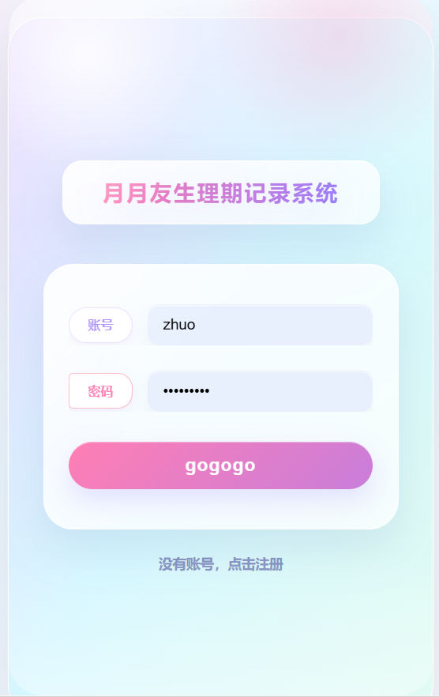<br/>登录页</td>
    <td align="center">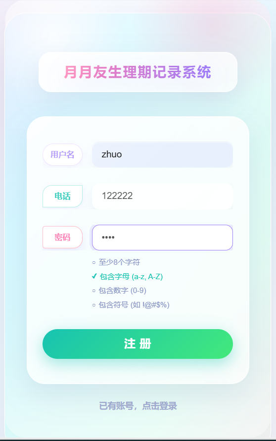<br/>注册页</td>
  </tr>
</table>

### 健康记录与 AI 分析

<table>
  <tr>
    <td align="center">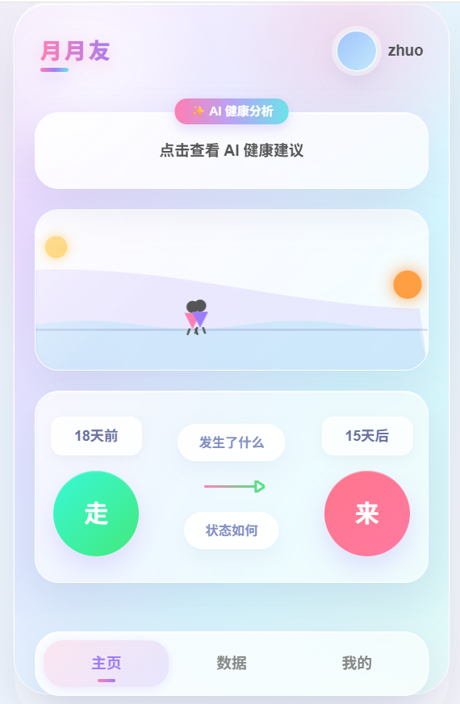<br/>首页周期状态</td>
    <td align="center">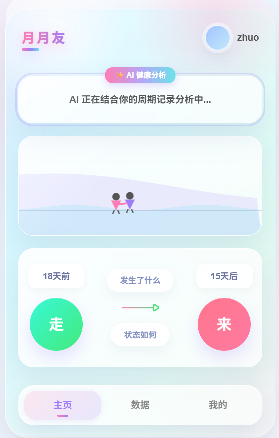<br/>点击触发 AI 分析</td>
    <td align="center">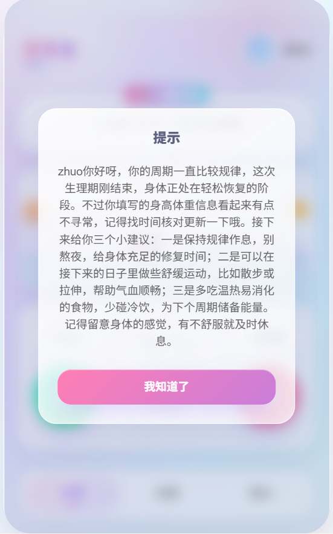<br/>AI 健康建议</td>
  </tr>
  <tr>
    <td align="center">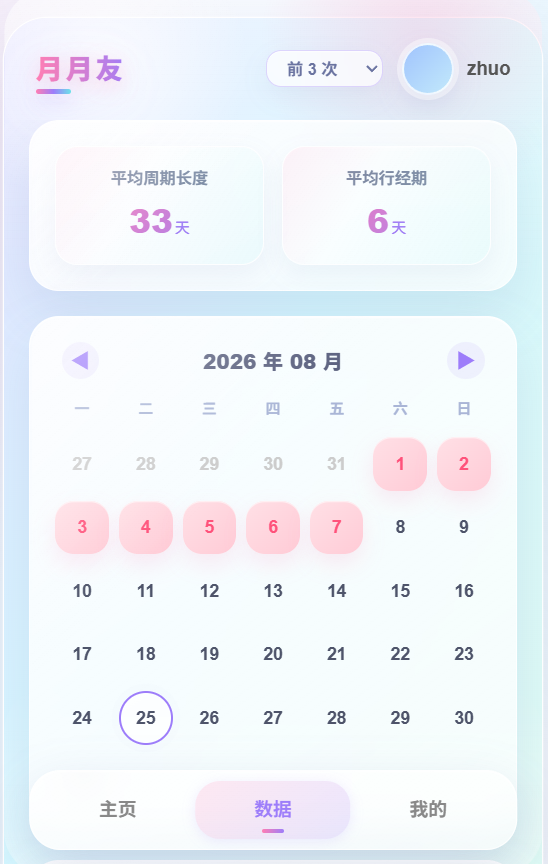<br/>周期数据看板</td>
    <td align="center">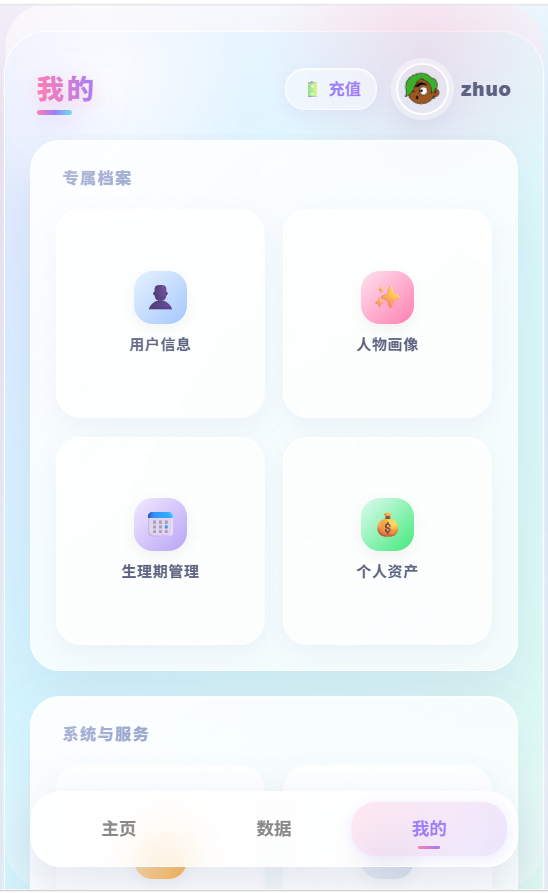<br/>我的页面</td>
    <td align="center">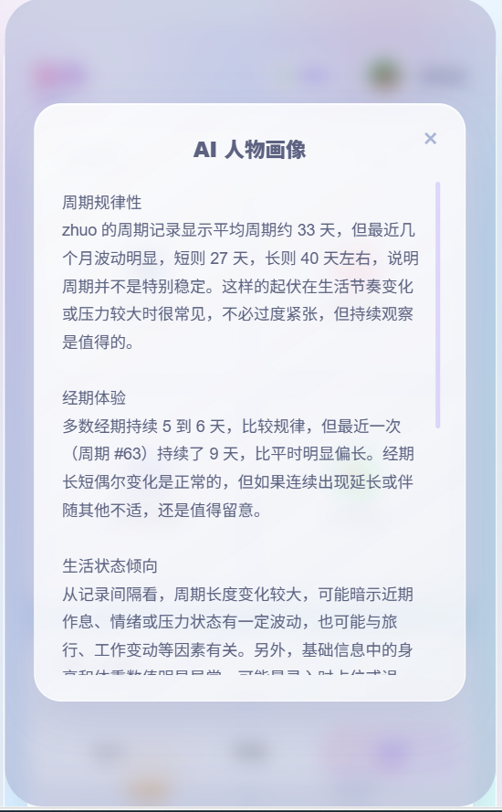<br/>AI 人物画像</td>
  </tr>
</table>

### 档案与周期管理

<table>
  <tr>
    <td align="center">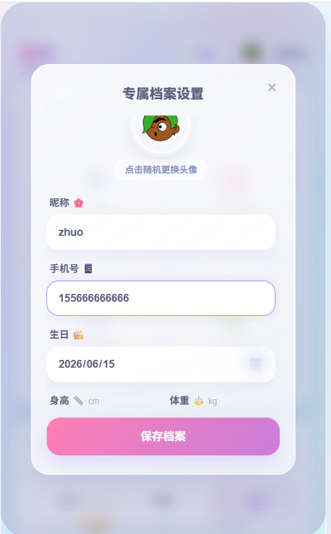<br/>个人档案</td>
    <td align="center">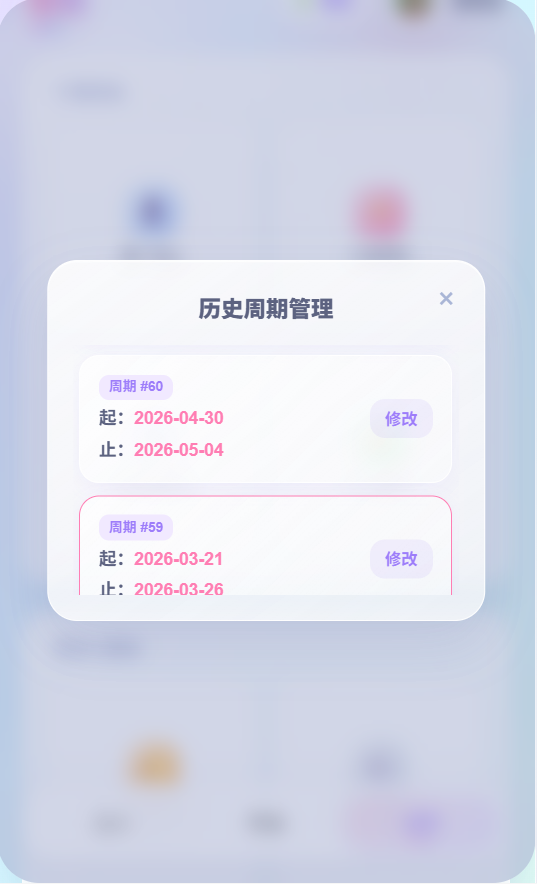<br/>生理期管理</td>
  </tr>
</table>

### 会员年卡、拼团与支付

<table>
  <tr>
    <td align="center"><br/>拼团会员页</td>
    <td align="center"><br/>发起拼团成功</td>
    <td align="center">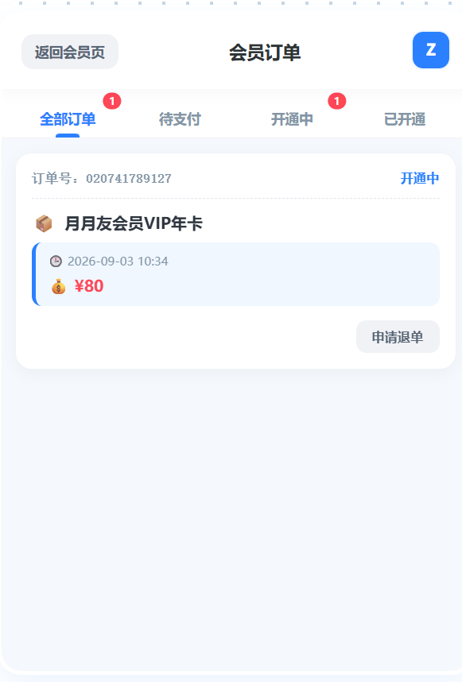<br/>订单管理</td>
  </tr>
  <tr>
    <td align="center">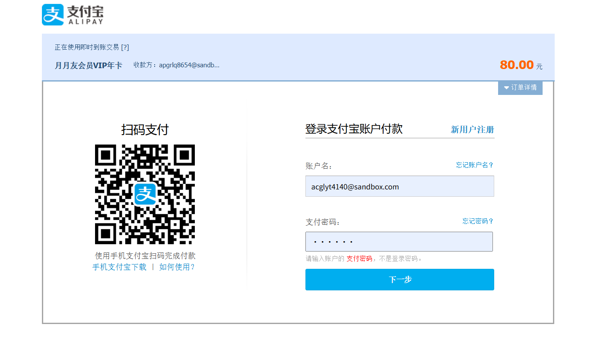<br/>支付宝支付页</td>
    <td align="center">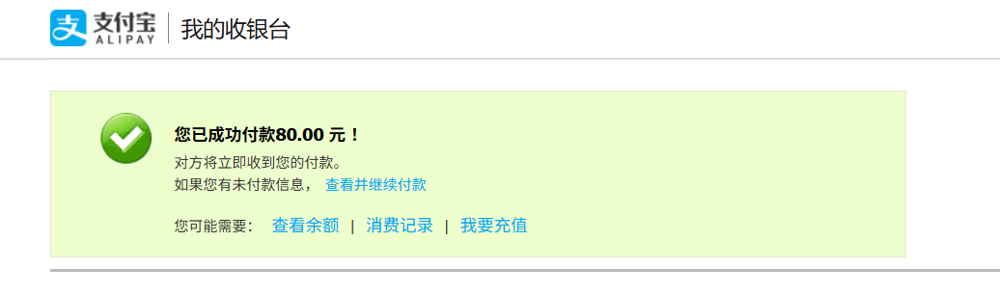<br/>支付完成</td>
  </tr>
</table>

## 核心业务闭环

完整链路可以概括为：

```text
用户登录/注册
  -> 维护个人档案
  -> 记录生理周期和每日症状
  -> 首页查看周期预测、健康状态和数据趋势
  -> 点击 AI 卡片触发健康建议或人物画像
  -> 进入会员年卡页
  -> 拼团营销试算
  -> 创建订单并锁定拼团名额
  -> 调用支付宝生成支付单
  -> 支付宝异步回调验签
  -> 更新订单支付状态
  -> 拼团成团结算
  -> RabbitMQ 异步开通会员权益
  -> 异常场景进入支付补偿、超时关单或退款退单
```

项目重点不是单个接口的增删改查，而是多个业务域协作后的交易完整性：正向交易、异步履约和逆向退款都被纳入了设计。

## 系统架构

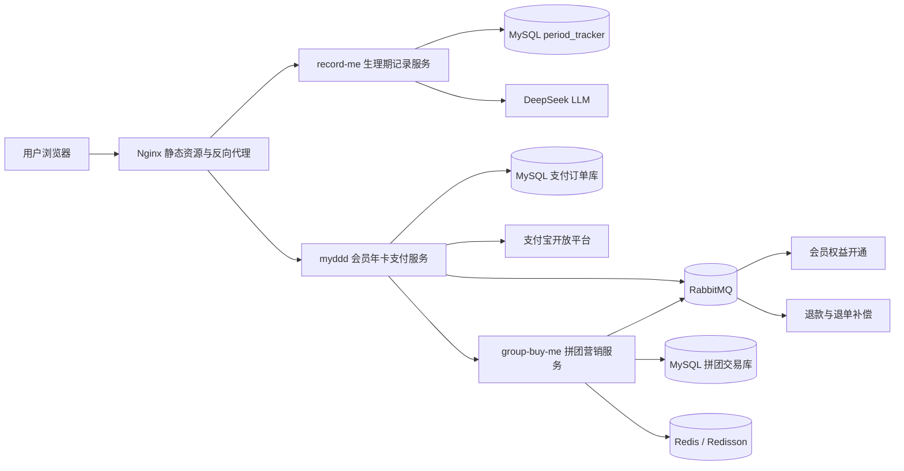

### 服务职责

| 服务 | 职责 | 关键能力 |
| --- | --- | --- |
| `record-me` | 生理期记录和用户健康入口 | 登录注册、周期预测、症状打卡、数据看板、AI 健康建议、AI 人物画像 |
| `myddd` | 会员年卡支付服务 | 订单创建、支付宝预支付、回调验签、支付补偿、超时关单、会员权益开通、退款 |
| `group-buy-me` | 拼团营销交易服务 | 营销试算、优惠策略、拼团锁单、名额占用、成团结算、退单补偿、动态治理 |

## 技术栈

### 月月友记录服务 `record-me`

| 分类 | 技术 |
| --- | --- |
| 开发语言 | Java 8 |
| 核心框架 | Spring Boot 2.7.12、Spring MVC |
| 工程结构 | Maven 多模块、DDD 分层、Repository 适配器 |
| 数据访问 | MyBatis 2.1.4、MySQL 8、HikariCP |
| 安全能力 | BCrypt 密码加密、登录态 Cookie / LocalStorage 维护 |
| AI 能力 | DeepSeek LLM、RestTemplate、Fastjson、点击触发式 AI 分析 |
| 前端 | HTML5、CSS3、原生 JavaScript、Fetch API、响应式移动端界面 |
| 部署 | Docker、Docker Compose、Nginx、Logback、dev/test/prod 多环境配置 |
| 辅助组件 | Lombok、Guava、Apache Commons、Spring Security Crypto |

### 会员年卡支付服务 `myddd`

| 分类 | 技术 |
| --- | --- |
| 开发语言 | Java 8 |
| 核心框架 | Spring Boot 2.7.12、Spring MVC、Spring Transaction |
| 工程结构 | Maven 多模块、DDD 领域驱动设计、六边形架构 |
| 数据访问 | MyBatis 2.1.4、MySQL 8、HikariCP |
| 支付能力 | 支付宝 Java SDK、RSA2 签名校验、异步回调、退款接口 |
| 服务调用 | Retrofit2、OkHttp，对接微信能力和拼团营销服务 |
| 缓存 | Guava Cache，用于微信 AccessToken、二维码登录状态等本地缓存 |
| 消息队列 | RabbitMQ、Spring AMQP、Topic Exchange、消息持久化 |
| 定时补偿 | Spring `@Scheduled`，支付掉单补偿、超时关单 |
| 异步处理 | 自定义线程池，支持核心线程数、队列长度和拒绝策略配置 |
| 辅助组件 | Lombok、Fastjson、Hutool、Apache Commons |

### 拼团营销交易服务 `group-buy-me`

| 分类 | 技术 |
| --- | --- |
| 开发语言 | Java 8 |
| 核心框架 | Spring Boot 2.7.12、Spring MVC、Spring Transaction |
| 工程结构 | Maven 多模块、DDD、Repository、Port/Adapter |
| 数据访问 | MyBatis、MySQL 8、HikariCP |
| 缓存与并发 | Redis、Redisson、Redis Bitmap、原子计数器、分布式锁 |
| 消息队列 | RabbitMQ、Topic Exchange、消息持久化 |
| 业务设计 | 策略模式、责任链模式、策略树、模板方法、工厂模式 |
| 动态治理 | DCC 动态配置、灰度放量、降级开关、渠道黑名单、接口限流 |
| 一致性 | 本地消息表、事务控制、失败重试、补偿任务、幂等控制 |
| 监控日志 | Spring Boot Actuator、Micrometer、Prometheus、Logback |
| 部署 | Docker、Docker Compose、Nginx |
| 前端 | HTML、CSS、原生 JavaScript、Fetch API |

## DDD 分层设计

三个服务都尽量避免把业务逻辑写成传统的 Controller-Service-DAO 直连模式，而是采用更接近 DDD 和六边形架构的组织方式。

### `record-me` 模块划分

```text
record-me
├── record-me-api             # 对外接口协议、DTO、统一响应对象
├── record-me-domain          # 用户、周期、健康记录等核心领域模型和领域服务
├── record-me-infrastructure  # MyBatis DAO、PO、Repository 实现、数据库适配
├── record-me-trigger         # Controller、AI 调用入口、HTTP 触发器
├── record-me-types           # 通用枚举、异常、公共类型
└── record-me-app             # Spring Boot 启动类、配置文件、Dockerfile
```

### `myddd` 支付服务模块划分

```text
myddd
├── myddd-api             # 接口协议和 DTO
├── myddd-domain          # 订单聚合、支付聚合、会员权益领域服务
├── myddd-infrastructure  # MyBatis、RabbitMQ、支付宝、营销服务适配器
├── myddd-trigger         # Controller、MQ Listener、定时任务
├── myddd-types           # 公共类型、异常、事件模型
└── myddd-app             # 应用启动和基础配置
```

支付服务的领域层通过 Repository、Port 接口依赖外部能力，基础设施层负责具体实现，从而避免核心业务直接依赖 MyBatis、支付宝 SDK 或营销服务 HTTP 客户端。

### `group-buy-me` 拼团服务模块划分

```text
group-buy-me
├── group-buy-me-api             # 接口定义、请求和响应 DTO
├── group-buy-me-trigger         # HTTP 接口、RabbitMQ 消费者、定时任务
├── group-buy-me-domain          # 营销试算、锁单、结算、退单等核心业务
├── group-buy-me-infrastructure  # MyBatis、Redis、RabbitMQ、HTTP 回调等基础设施
├── group-buy-me-types           # 公共枚举、异常、设计框架与通用类型
└── group-buy-me-app             # 应用启动、组件装配和环境配置
```

这种拆分方式的价值在于：

- Controller 只负责参数接收、校验和响应转换，不承载核心业务决策。
- Domain 层沉淀实体、聚合、领域服务和业务规则，是项目最值得讲的部分。
- Infrastructure 层负责数据库、MQ、Redis、支付宝、外部 HTTP 服务等技术细节。
- API/Types 模块让接口协议、通用枚举和异常模型更清晰，便于服务之间协作。

## 记录系统业务设计

### 1. 登录注册与用户档案

`record-me` 支持用户注册、用户名/手机号登录、密码复杂度校验和 BCrypt 加密存储。登录成功后前端通过 Cookie 和 LocalStorage 维护用户登录状态，如果未登录直接访问主页，会自动跳转到登录页。

用户档案包括：昵称、头像、手机号、生日、身高、体重、平均周期天数、平均经期天数等。这些信息会被周期预测和 AI 分析共同使用。

### 2. 生理周期管理

用户可以在首页开始或结束一次生理周期，系统会维护当前周期和历史周期记录。结束周期后，会根据历史记录重新计算平均周期长度，为后续预测提供基础数据。

核心数据包括：

- 当前周期开始时间
- 当前周期结束时间
- 平均周期天数
- 平均经期天数
- 预测下次开始时间
- 预测本次结束时间
- 当前状态：经期内 / 经期外

### 3. 每日症状打卡

首页支持记录当天症状，例如流量、疼痛等级、心情和备注。症状数据与周期记录关联，后续可用于 AI 分析和用户画像生成。

### 4. 数据看板

数据页会展示最近周期记录、平均周期、平均经期和趋势信息，让用户能够快速看到周期变化。

### 5. AI 健康建议与人物画像

系统接入 DeepSeek LLM，但没有在每次刷新页面时自动请求模型，而是采用“点击触发”模式：

- 首页 AI 卡片：点击后根据当前周期状态、历史周期和症状记录生成健康建议。
- 我的页面人物画像：点击后汇总用户档案、周期历史、症状数据，生成更完整的健康画像。

这样可以避免页面刷新时频繁访问 LLM，降低等待时间和接口成本，也让用户明确知道什么时候触发 AI 分析。

AI 输出遵循谨慎原则：只基于记录数据给出健康建议，不做疾病诊断，不开药，不制造焦虑；遇到明显异常时提示线下咨询医生。

## 支付服务业务设计

### 1. 完整的会员年卡支付闭环

会员年卡支付服务覆盖了从下单到履约的完整链路：

```text
创建业务订单
  -> 调用拼团营销服务进行试算/锁单
  -> 计算优惠金额
  -> 调用支付宝生成支付表单
  -> 用户完成支付
  -> 支付宝异步回调
  -> 校验交易状态和 RSA2 签名
  -> 更新订单支付状态
  -> 拼团结算
  -> RabbitMQ 异步开通会员权益
  -> 支付补偿或退款退单
```

这里的重点不是“调用支付宝”，而是对支付系统中常见异常做了链路设计：重复下单、预支付失败、回调丢失、超时未支付、拼团失败、退款退单等。

### 2. 重复下单复用与支付掉单补偿

创建订单前会检查用户是否已有同商品的未支付订单：

- 如果已有支付链接，则直接复用原订单和支付链接。
- 如果订单已创建但支付链接生成失败，则重新发起预支付。
- 如果营销锁单未完成，则重新调用营销锁单。
- 如果用户已支付但回调丢失，则定时任务主动查询支付宝交易状态。
- 如果超过 30 分钟仍未支付，则定时关闭订单。

这部分在简历中建议写成“重复下单复用和补偿机制”，不要夸大为“完全解决高并发幂等”。因为更完整的强并发幂等通常还需要分布式锁、数据库状态条件更新、唯一索引、消息幂等等多层保障。

### 3. 支付回调验签与状态推进

支付回调不会直接相信请求参数，而是先校验支付宝交易状态和 RSA2 签名，再推进本地订单状态。这样可以避免伪造回调或重复回调直接污染订单状态。

支付成功后不会在回调线程里处理所有履约逻辑，而是通过 MQ 推动后续会员权益开通，降低回调接口耗时和外部系统耦合。

### 4. RabbitMQ 异步解耦

支付服务使用 RabbitMQ Topic Exchange 处理：

- 支付成功后的会员权益开通
- 拼团成功后的批量结算
- 拼团失败或用户退单后的退款
- 支付服务与履约逻辑解耦

生产端设置消息持久化，消费异常时继续抛出异常以触发重试。简历可以写“通过 RabbitMQ 实现支付与权益开通异步解耦”，但不建议写“保证消息绝不丢失”，因为严格的可靠消息体系还需要生产者确认、消费幂等、死信队列和人工补偿后台。

### 5. 外部营销系统解耦

支付服务通过 Retrofit2 对接独立拼团营销服务，覆盖：

- 营销试算
- 营销锁单
- 支付结算
- 拼团退款

领域层只依赖 Port 接口，不直接依赖具体 HTTP 实现，体现了六边形架构中的端口与适配器思想。

## 拼团营销系统业务设计

### 1. 完整的拼团交易闭环

拼团服务负责营销侧的正向交易和逆向补偿：

```text
营销试算
  -> 拼团锁单
  -> Redis 名额占用
  -> 订单落库
  -> 支付结算
  -> 成团判定
  -> HTTP / MQ 通知
  -> 超时退单
  -> 库存恢复
```

相比普通商城项目，它更有业务深度，因为同时包含优惠试算、锁单并发、成团结算和退单补偿。

### 2. 策略树编排营销试算

营销试算不是写在一个大方法里，而是通过策略树按步骤处理：

- 请求参数校验
- 系统降级判断
- 用户灰度放量
- 商品和活动配置查询
- 优惠价格计算
- 人群标签判断
- 最终试算结果组装

这种设计的好处是，后续新增会员等级、地区限制、节日活动、人群券等规则时，可以增加节点，而不是重写整个流程。

### 3. 可扩展优惠计算引擎

系统用策略模式实现多种优惠模型：

| 优惠模型 | 含义 |
| --- | --- |
| `N` | 固定价格 |
| `ZJ` | 直减 |
| `ZK` | 折扣 |
| `MJ` | 满减 |

运行时根据数据库配置选择对应策略，实现“配置驱动业务”。后续增加阶梯折扣、会员价、优惠券叠加时，只需要新增策略实现。

### 4. 责任链编排交易规则

锁单、结算和退单分别使用责任链拆分业务校验。

锁单责任链包含：

- 活动可用性检查
- 用户参与次数限制
- 拼团队伍名额占用

结算责任链包含：

- 外部交易单检查
- 渠道来源检查
- 可结算状态检查

退单责任链包含：

- 订单数据加载
- 防重复退单检查
- 退单策略选择

这种方式避免形成一个几百行的交易方法，也让规则更容易组合、测试和扩展。

### 5. Redis 控制拼团名额并提供失败补偿

拼团名额采用 Redis 原子计数进行占用，并结合：

- `SET NX` 幂等锁
- Redisson 分布式锁
- Key 有效期
- 数据库条件更新
- 锁单失败后的名额恢复
- 退单成功后的库存补偿

这是项目中最适合面试展开讲的并发场景之一：为什么不能只靠数据库扣库存，如何减少热点行压力，Redis 扣减失败和数据库落库失败时如何回滚。

### 6. 本地消息表保障通知可靠性

支付结算和退单操作会在同一个数据库事务中写入业务数据和通知任务，再由后台任务异步发送 HTTP 或 RabbitMQ 消息。

通知失败后会：

- 更新重试次数
- 最多重试固定次数
- 定时扫描未完成任务
- 多实例之间通过分布式锁抢占任务

这是典型的“本地消息表 + 异步重试”最终一致性方案。简历中可以写“保障业务数据和通知任务的一致性”，但不建议直接写成“实现分布式事务”。

### 7. 较完整的逆向退单处理

系统针对不同订单状态设计不同退单策略：

- 未支付、未成团
- 已支付、未成团
- 已支付、已成团

退单后通过 RabbitMQ 异步恢复拼团队伍名额，并使用订单维度的幂等锁避免重复恢复。

### 8. 动态配置和服务治理

拼团系统支持动态调整：

- 全局降级开关
- 用户灰度比例
- 来源渠道黑名单
- Redis 缓存开关
- 接口访问频率限制

例如可以只让部分用户参与新活动；如果营销系统出现异常，也可以快速关闭试算或缓存能力，而不必重新发布程序。

### 9. Redis Bitmap 做人群标签

用户是否属于指定营销人群通过 Redis Bitmap 判断，适用于大规模布尔型标签：

- 是否为 VIP
- 是否为新用户
- 是否属于活动目标人群

相比为每个用户存储完整对象，Bitmap 在此类场景下更节省内存。

### 10. 并行查询降低试算等待

营销试算时，商品信息和活动优惠配置互不依赖，因此可以通过自定义线程池和 `FutureTask` 并行查询，再汇总到上下文中。

自定义线程池支持配置核心线程数、最大线程数、队列容量和拒绝策略，便于根据业务压力调整。

## 核心接口概览

### 记录系统接口

| 模块 | 接口 | 说明 |
| --- | --- | --- |
| 认证 | `POST /record/auth/login` | 用户名或手机号登录 |
| 认证 | `POST /record/auth/register` | 用户注册 |
| 首页 | `POST /record/index/query_user_info` | 查询首页周期状态、预测时间和用户信息 |
| 首页 | `POST /record/index/start_cycle_record` | 开始新的生理周期 |
| 首页 | `POST /record/index/over_cycle_record` | 结束当前生理周期 |
| 症状 | `POST /record/index/query_symptom` | 查询今日症状打卡 |
| 症状 | `POST /record/index/change_symptom` | 新增或更新今日症状 |
| 数据 | `POST /record/data/query_cycle_list` | 查询周期历史数据 |
| 我的 | `POST /record/mine/getUsrInfo` | 查询个人档案 |
| 我的 | `POST /record/mine/changeUserInfo` | 修改个人档案 |
| 我的 | `POST /record/mine/getUserRecord` | 分页查询周期记录 |
| 我的 | `POST /record/mine/changeUserRecord` | 修改周期记录 |
| AI | `POST /record/ai/health_advice` | 点击触发首页 AI 健康建议 |
| AI | `POST /record/ai/persona` | 点击触发 AI 人物画像 |

### 支付与拼团接口能力

| 模块 | 典型能力 |
| --- | --- |
| 商品/会员 | 查询会员年卡商品、展示商品权益、展示会员状态 |
| 营销试算 | 根据用户、商品、渠道、活动配置计算拼团优惠价格 |
| 拼团锁单 | 占用拼团队伍名额，生成营销锁单记录 |
| 支付下单 | 创建业务订单，复用未支付订单，生成支付宝支付表单 |
| 支付回调 | 接收支付宝异步通知，校验签名，推进订单状态 |
| 支付补偿 | 定时查询支付宝交易状态，处理掉单 |
| 超时关单 | 扫描超过有效期未支付订单，关闭本地订单并释放营销锁单 |
| 成团结算 | 拼团人数满足后结算队伍，通知支付服务履约 |
| 退款退单 | 根据订单状态选择退单策略，调用支付宝退款并恢复拼团资源 |

## 数据库设计概览

### 记录系统核心表

| 表名 | 说明 |
| --- | --- |
| `user_info` | 用户基础信息，包含用户名、密码、头像、手机号、生日、身高、体重、平均周期天数、平均经期天数 |
| `cycle_record` | 生理周期记录，包含开始日期、结束日期、当前周期标记、逻辑删除字段 |
| `daily_symptom` | 每日症状打卡，包含流量、疼痛等级、心情和备注 |
| `daily_behavior_log` | 每日行为与外部因素聚合数据，使用 JSON 保存饮食、运动、睡眠、用药等行为 |
| `user_login_log` | 用户登录痕迹，用于记录登录 IP、设备和登录状态 |

### 支付与拼团系统典型数据

支付服务通常围绕订单、支付单、会员权益、支付回调流水、补偿任务等表展开；拼团服务通常围绕活动、商品、优惠配置、拼团队伍、拼团订单、通知任务和退单记录展开。

两个服务的共同设计目标是：业务状态可追踪、异常链路可补偿、外部通知可重试。

## 前端设计

前端采用原生 HTML、CSS 和 JavaScript，没有引入大型前端框架，便于部署到 Nginx 静态目录。

### 页面组成

```text
docs/dev-ops/nginx
├── login.html        # 登录 / 注册页面
├── index.html        # 首页周期状态和 AI 健康建议
├── data.html         # 数据看板
├── mine.html         # 我的页面、档案、周期管理、AI 人物画像
├── css               # 页面样式、移动端外壳、动效优化
└── js                # 接口请求、登录态校验、页面交互
```

### 交互优化

- 电脑浏览器打开时仍保持手机屏幕样式，便于模拟移动端体验。
- 登录态缺失时自动跳转登录注册页。
- 首页 AI 建议和人物画像均为点击触发，避免刷新页面时阻塞。
- AI 弹窗支持长文本滚动，避免内容展示不全。
- API 地址在前端脚本顶部集中处理，本地打开时自动请求 `127.0.0.1:8088`，线上部署时使用同源反向代理。
- 底部导航、卡片、弹窗、按钮增加玻璃拟态、渐变、阴影、过渡动画和移动端触摸反馈。

## 部署说明

### 环境要求

- JDK 8 或以上
- Maven 3.6+
- Docker
- Docker Compose
- MySQL 8
- Nginx

### 本地启动记录系统

1. 创建数据库并导入脚本：

```bash
mysql -uroot -p < docs/dev-ops/mysql/sql/record.sql
```

2. 修改开发环境数据库配置：

```text
record-me-app/src/main/resources/application-dev.yml
```

3. 编译项目：

```bash
mvn clean package -DskipTests
```

4. 启动后端：

```bash
java -jar record-me-app/target/record-me-app.jar --spring.profiles.active=dev
```

5. 访问前端：

```text
docs/dev-ops/nginx/login.html
```

或者通过 Nginx 托管静态资源后访问。

### Docker Compose 部署记录系统

1. 启动基础环境：

```bash
cd docs/dev-ops
docker compose -f docker-compose-environment.yml up -d
```

2. 构建应用 Jar：

```bash
mvn clean package -DskipTests
```

3. 构建后端镜像：

```bash
cd ../../record-me-app
sh build.sh
```

4. 启动应用和 Nginx：

```bash
cd ../docs/dev-ops
docker compose -f docker-compose-app.yml up -d
```

5. 访问：

```text
http://record.daoha.top
```

生产环境建议通过 `.env` 或服务器环境变量配置：

```bash
DEEPSEEK_API_KEY=你的 DeepSeek Key
```

不要把真实 API Key、支付宝私钥、数据库密码提交到 GitHub。

### Nginx 说明

Nginx 负责两件事：

- 托管 `docs/dev-ops/nginx` 下的静态页面。
- 将 `/record/` 开头的 API 请求反向代理到 `record-me-app:8088`。

线上域名规划：

| 域名 | 说明 |
| --- | --- |
| `daoha.top` | 主域名 |
| `record.daoha.top` | 月月友记录系统访问域名 |
| `82.157.190.244` | 服务器 IP |

## 配置说明

### 记录服务核心配置

```yaml
server:
  port: 8088

spring:
  profiles:
    active: dev
  datasource:
    url: jdbc:mysql://127.0.0.1:3306/period_tracker
    username: root
    password: 123456

llm:
  deepseek:
    model: deepseek-v4-flash
    base-url: https://api.deepseek.com
    api-key: ${DEEPSEEK_API_KEY:}
    timeout: 120
    max-retries: 3
    retry-sleep: 2.0
```

### 前端 API 地址

前端默认策略：

- 本地 `file://` 打开或使用本地静态服务时，请求 `http://127.0.0.1:8088`。
- 线上通过 Nginx 部署时，使用同源地址，让 Nginx 反向代理到后端服务。
- 如果需要手动覆盖，可以在页面中设置：

```html
<script>
  window.__RECORD_ME_API_BASE__ = 'http://127.0.0.1:8088';
</script>
```

## 简历写法参考

### 项目名称

月月友生理期管理系统：基于 DDD 架构的会员年卡支付与拼团交易系统

### 简历描述

- 基于 Java 8、Spring Boot、MyBatis、MySQL、RabbitMQ、Redis、Docker 和 Nginx 搭建月月友生理期管理、会员年卡支付与拼团交易系统，覆盖健康记录、AI 建议、会员购买、营销锁单、支付宝支付、回调验签、补偿关单、拼团结算、权益开通和退款退单完整业务链路。
- 采用 DDD 分层和 Maven 多模块拆分，将接口协议、领域模型、基础设施适配、触发器和公共类型解耦；领域层通过 Repository 和 Port 接口依赖外部能力，降低业务逻辑对 MyBatis、支付宝 SDK、Redis、RabbitMQ 和 HTTP 客户端的直接依赖。
- 设计会员年卡支付闭环，支持重复下单复用、支付宝预支付、RSA2 回调验签、支付状态推进、定时掉单补偿和超时关单，提升支付链路在网络异常、回调丢失和重复请求场景下的稳定性。
- 设计拼团营销交易链路，通过策略树编排营销试算，通过策略模式支持固定价、直减、折扣、满减等优惠模型，通过责任链拆分锁单、结算、退单规则，提升复杂营销规则的可扩展性。
- 使用 Redis 原子计数、Redisson 分布式锁、`SET NX` 幂等锁和数据库条件更新控制拼团名额占用，并在锁单失败、退单成功等场景中进行库存恢复和任务补偿。
- 使用 RabbitMQ 解耦支付成功后的会员权益开通、拼团成功后的批量结算和失败退单后的退款流程；结合本地消息表、失败重试和定时任务实现业务数据与通知任务的一致性保障。
- 在记录系统中接入 DeepSeek LLM，根据用户周期、症状和档案数据生成健康建议与用户画像；采用点击触发方式避免页面刷新频繁调用模型，并对 LLM 空响应、异常响应和长文本展示进行容错处理。
- 前端使用 HTML、CSS、原生 JavaScript 和 Fetch API 实现移动端风格页面，支持登录态拦截、周期状态展示、症状打卡、数据看板、档案编辑、AI 弹窗、会员商品页、订单列表和支付确认交互。

### 面试重点讲法

建议优先讲以下四条主线：

1. **DDD 架构拆分**：为什么把 api、domain、infrastructure、trigger、types、app 拆开，领域层如何不依赖具体技术实现。
2. **支付交易闭环**：从创建订单、营销锁单、支付宝支付、回调验签到权益开通，异常时如何补偿。
3. **拼团并发控制**：Redis 名额占用、Redisson 锁、幂等锁、数据库状态更新和失败恢复之间如何配合。
4. **异步一致性**：RabbitMQ、本地消息表、定时任务、失败重试分别解决什么问题，哪些地方还可以继续增强。

## 项目边界与后续优化

当前项目已经具备较完整的业务链路，但仍有一些可以继续增强的方向：

- 支付消息可靠性：补充生产者 Confirm、消费者幂等表、死信队列和告警后台。
- 强幂等控制：关键状态流转增加数据库条件更新、唯一索引和业务流水号约束。
- 服务治理：如果后续服务数量继续增加，可以再引入注册中心、配置中心和网关，但当前项目不应描述为 Spring Cloud 微服务。
- 安全治理：生产环境统一使用环境变量管理支付宝密钥、DeepSeek Key、数据库密码和 JWT 密钥。
- 测试完善：补充领域服务单元测试、支付回调验签测试、拼团锁单并发测试和补偿任务集成测试。
- 可观测性：完善 Prometheus 指标、日志 TraceId、关键链路耗时统计和失败告警。

## 项目亮点总结

- 不是单一 CRUD 项目，而是健康记录、会员支付和拼团营销组合后的完整业务系统。
- 不是简单调用支付宝，而是覆盖订单、支付、回调、补偿、结算、权益、退款的交易闭环。
- 不是把业务写在大 Service 中，而是通过 DDD、多模块、策略树、责任链、Port/Adapter 组织复杂业务。
- 不是只展示页面，而是有 MySQL 表结构、Docker Compose、Nginx 反向代理、多环境配置和真实部署规划。
- AI 能力不是刷新即调用，而是按需点击触发，并结合用户周期数据生成个性化建议。
